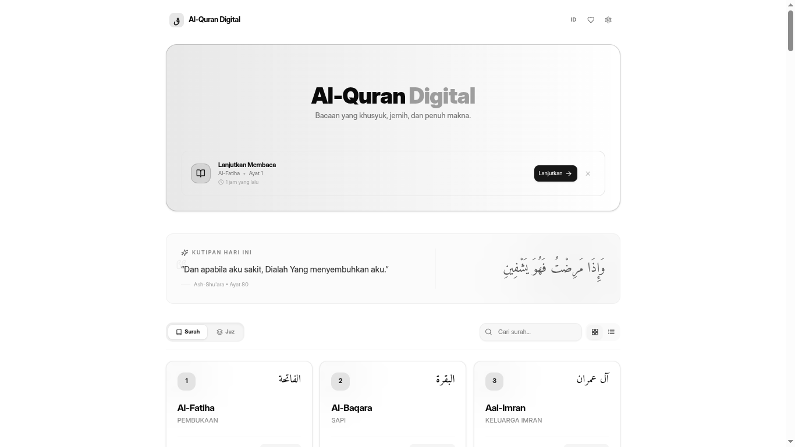
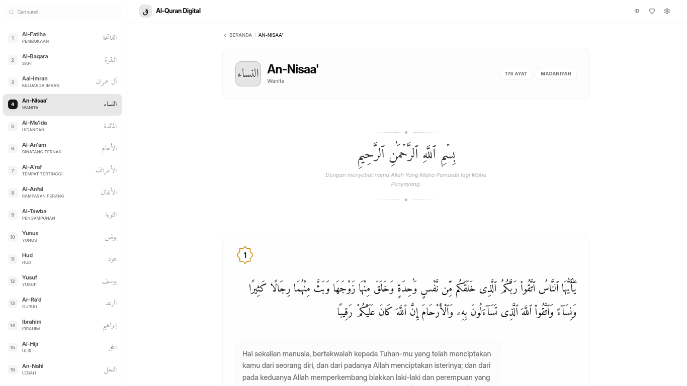
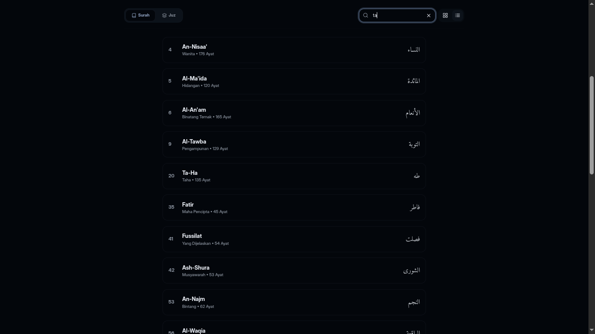
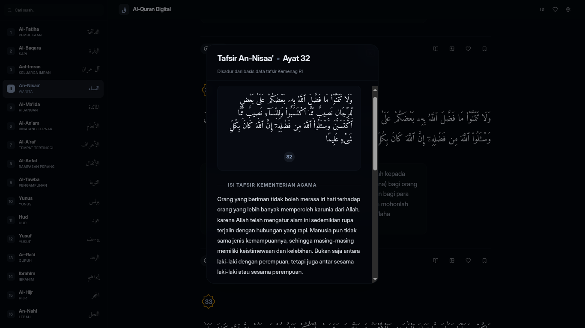
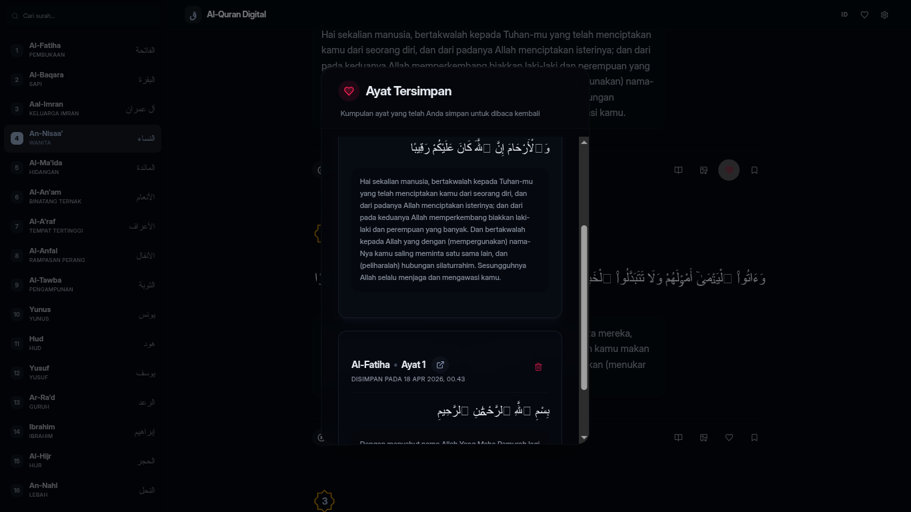
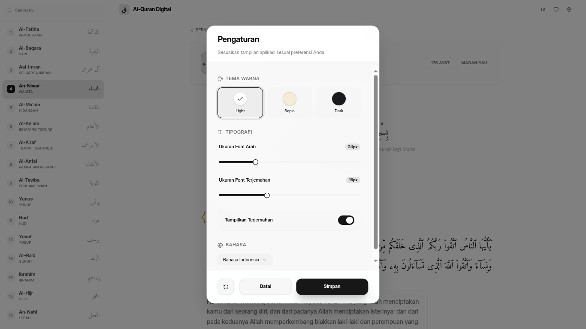

# Al-Quran Digital 📖

Al-Quran Digital is a modern web application designed for reading the Holy Quran with a minimalist design, serene, distraction-free experience. Built with the latest Next.js App Router, the interface is completely focused on elegant Arabic typography, clean layouts, and comfortable readability, ensuring your eyes remain relaxed during long reciting sessions.

🌐 **Live Demo:** [https://mysimplequran.vercel.app](https://mysimplequran.vercel.app)

---

## Key Features

- **Complete Collection**: Access all 114 Surahs and 30 Juz with ease.
- **Bilingual & Tafsir**: Includes translations in Indonesian and English, plus the official Kemenag Tafsir for in-depth understanding.
- **Interactive Audio**: Listen to beautiful Murottal recitations natively embedded within each verse.
- **Progress Tracking**: Automatic bookmarking lets you continue reading exactly where you left off.
- **Personalization**: Switch between Light, Dark, and Sepia themes. Adjust the Arabic typography weight and scale.
- **Offline Capable**: Installed as a Progressive Web App (PWA), meaning it works offline securely.
- **Privacy First**: All historical data, bookmarks, and visual preferences are safely stored locally in your browser.
- **SEO Optimized**: Fully equipped with dynamic sitemaps, JSON-LD structured data, and rich web snippets.

---

## Built With

This project intialized by Vercel v0 and also relies on modern web technologies for optimal performance and seamless developer experience:
- **[Next.js](https://nextjs.org/)** (v15+) - React framework with App Router
- **[Tailwind CSS](https://tailwindcss.com/)** (v4) - Utility-first styling architecture
- **[TypeScript](https://www.typescriptlang.org/)** - For type safety and better tooling
- **[Lucide Icons](https://lucide.dev/)** - Clean and beautiful scalable icons
- **[Serwist](https://serwist.pages.dev/)** - Next-generation PWA & Service Worker toolkit
- **[Radix UI](https://www.radix-ui.com/)** - Unstyled, accessible component primitives

---

## Interface Previews

**Main Dashboard**
The landing page greets you with a randomly selected daily verse and a quick shortcut to continue your last reading session.


**Surah Reading Mode**
 Elegantly combines the Arabic script with its translation in a parallel, clean window.


**Inclusive Search Experience**
Instantly filter through the entire index based on phrase matches to locate specific chapters.


**Detailed Tafsir View**
Scholarly tafsir explanations are presented in a wide, dedicated overlay for deep immersion.


**Saved Verses Management**
Bookmarked and favorite verses are gathered in an organized modal view for quick referencing.


**Personalized Settings**
Adjust color schemes, typography weight, and textual scaling to your exact liking.


---

## Installation

For developers who wish to explore the codebase or host their own version, setup is extremely straightforward.

1. **Clone the repository:**
   ```bash
   git clone https://github.com/gper00/minimalist-quran.git
   cd minimalist-quran
   ```

2. **Install dependencies:**
   ```bash
   pnpm install
   # or npm install / yarn install
   ```

3. **Run the development server:**
   ```bash
   pnpm run dev
   ```
   Open [http://localhost:3000](http://localhost:3000) with your browser to see the result.

4. **Build for production:**
   ```bash
   pnpm run build
   ```

---

## Unrestricted Distribution

The Al-Quran project is an entirely open-source initiative created as an absolute and free contribution to the wider community.

Above all, this digital interface project does not require any licensing and enforces absolutely **zero copyright restrictions** (Public Domain). Everyone is strictly free to copy, distribute, modify, or rebuild the entire codebase into their own standalone applications without any limitations.

You are widely welcomed to adapt the logic for your needs without any obligation to provide attribution or seek initial permissions. The sole purpose of this repository is to openly spread the benefits of the Al-Quran text and act as an accessible foundation for future Islamic developments without the bureaucratic hurdles of proprietary licenses.

---

## Contact

Crafted with dedication by [**Umam Alfarizi**](https://umamalfarizi.is-a.dev)
